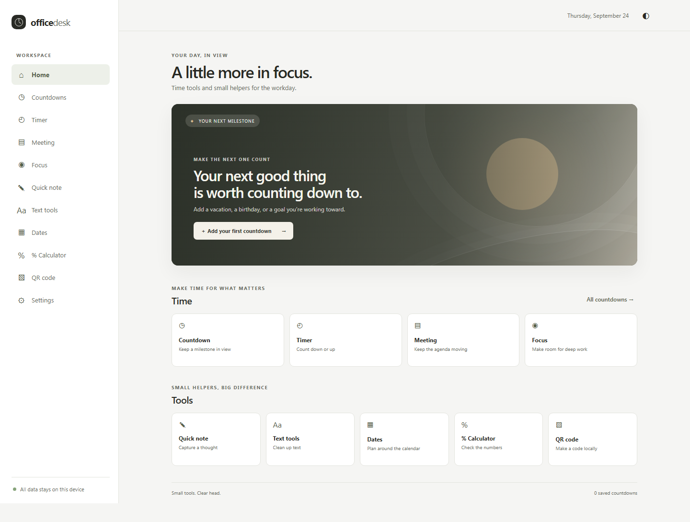
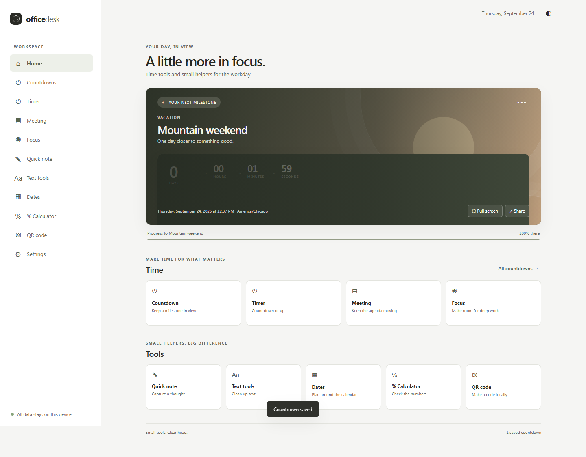
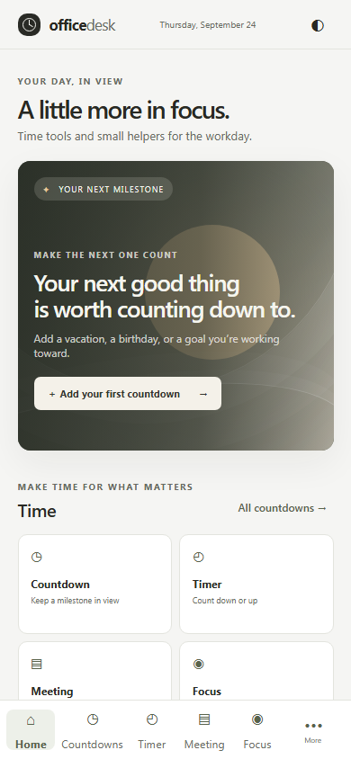

# Office Desk

A small place for the time and office tools you use every day. Office Desk is a private, zero-install browser utility: countdowns, timers, meeting pacing, focus sessions, notes, text cleanup, date math, business percentages, and local QR generation.

## Privacy

Saved countdowns, notes, checklist items, and preferences stay in browser storage on this device. No account, backend, analytics, ads, or third-party runtime requests are used. Countdown sharing creates a URL containing only the configuration you choose to share; custom images and unrelated saved data are excluded. See [Privacy](docs/privacy.md).

## Use

- Open the hosted app: https://jpar83.github.io/office-desk/
- For the portable file, download `OfficeDesk.html` from the latest GitHub release and open it in Edge or Chrome. No local server is required.
- On a supported browser, use the browser’s install option to add the offline PWA.

## Screenshots







## Development

Requirements: Node.js 20.19+ or 22.12+ and pnpm.

```sh
pnpm install
pnpm dev
pnpm lint
pnpm typecheck
pnpm test
pnpm test:coverage
pnpm test:e2e
pnpm build
pnpm build:portable
pnpm verify
```

`pnpm build` creates the GitHub Pages PWA in `dist/`. `pnpm build:portable` creates the network-independent `dist-portable/OfficeDesk.html` file.

## Architecture

- React and TypeScript with strict checking, built by Vite.
- Hash routes support the Pages repository subpath and share links.
- Versioned `officeDesk.v1` localStorage stores user data.
- Countdown and timer displays derive from target timestamps.
- The service worker caches the application shell after a hosted visit.

More: [Architecture](docs/architecture.md), [User guide](docs/user-guide.md), [Quality report](docs/quality-report.md).

## Browser support and limitations

Current Edge, Chrome, Firefox, and Safari are the intended browsers. PWA install and notifications depend on browser support and permissions. The date calculator excludes weekends only; it does not exclude federal or company holidays. `OfficeDesk.html` runs the core tools locally; service-worker installation and browser notifications are hosted-context capabilities.

## Deployment

GitHub Actions runs lint, typecheck, unit tests, and both production builds before publishing to Pages on pushes to `main`. The portable file is retained as a CI artifact and attached to the tagged release when release credentials permit.
